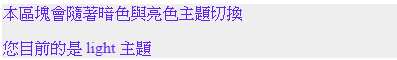

# 第三週補充教材

## 字體

### 基本字體運用技巧

```css
body {
  /* Segoe UI 為微軟的預設英文字體 */
  font-family: -apple-system, BlinkMacSystemFont, 'Segoe UI',
    'Microsoft JhengHei', Roboto, 'Helvetica Neue', Arial, sans-serif;
}
```

`font-family` 分為兩個部分，一個是指定字體 `family-name`，另一種是泛用字 `generic-family`

### 泛用字

泛用字簡單來說，就是系統的明體、黑體、捲曲字等預設值，並不是指定特定的字體，而也可稱為 **字體集**、**統稱字體**、**泛用字集**、**通用字體集** 等

:::warning 注意

並非所有瀏覽器及系統的預設泛用字是相同的

:::

一般來說定義 `font-family` 時，會將泛用字放在 **最後方**，如：

```css
body {
  /*最後方的是 sans-serif(黑體)*/
  font-family: 'Lucida Grande', Helvetica, Arial, Verdana, sans-serif;
}
```

### 指定字體

只要直接輸入字型名稱即可，但特別要注意的是如果字體名稱中有 **空白**，就必須用 `''` 或 `""` 將他括起來。

另外在 **優先順序** 上，放在前方的字體會先被套用，如果不能才會套用次要的字體，也可以利用這方式來套用不同的字體在中英文上。

如下方的範例，先 `Segoe UI`，其次是 `微軟正黑體`，最後再放 `泛用字`。

```css
body {
  font-family: 'Segoe UI', '微軟正黑體', sans-serif;
}
```

## Dark mode

語法上使用 `prefers-color-scheme` 來監測是亮色或暗色的主題，相對應的值也就是 `dark` 或 `light`

### 使用變數快速切換網頁的主題色

如果透過一個個的 `@media` 設定將會增加開發及管理的困難度，在開發時可以將暗色、亮色的佈景主題色彩以 **CSS 變數** 的方式作定義，避免直接將色彩寫入 CSS 元素上，接下來在 `@media` 中僅需要改變 CSS 的變數就能夠完整切換所有元件的主題色彩。

```html
<div class="demo mode">
  <p>本區塊會隨著暗色與亮色主題切換</p>
  <p>您目前的是 <span class="text-mode"></span> 主題</p>
</div>
```

```css
.mode {
  /* 紫色 */
  --theme-primary: #6222ee;
  --theme-background: #eee;
}
.mode {
  background-color: var(--theme-background);
  color: var(--theme-primary);
}
.text-mode:after {
  content: 'light';
}

/* 當主題色為深色時觸發 */
@media (prefers-color-scheme: dark) {
  .mode {
    --theme-primary: #bb85fc;
    --theme-background: #111;
  }
  .text-mode:after {
    content: 'dark';
  }
}
```



## 參考

[font-family 要怎麼玩](https://wcc723.github.io/css/2014/01/01/font-family/)
[精簡語法操作暗色主題 - CSS Dark Mode](https://wcc723.github.io/css/2019/12/22/css-dark-mode/)
