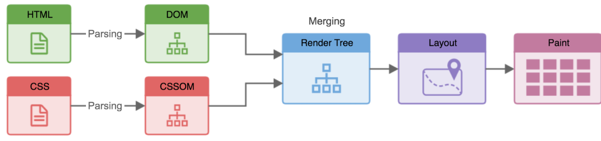

# Reflow and Repaint

## 瀏覽器的渲染步驟

上圖是瀏覽器解析網頁的示意圖，為方便理解，簡單拆解成幾個步驟：

1. 從 `HTML` 檔解析出 `DOM Tree`
1. 從 `CSS` 檔解析出 `CSSOM Tree`
1. 兩者疊加後產生 `Render Tree`
1. `Reflow`：計算出 `Render Tree` 上各個元素的物理屬性，如位置、大小、及是否看得見（visible）
1. `Repaint`：將計算結果轉為實際的像素，畫到畫面上

## Reflow

這個步驟會由 `Render Tree` 的根結點出發，逐步計算出每一個元素的位置、大小，以及是否被其他元素遮擋等屬性，需要耗費大量的運算資源；也因為是要計算出這些屬性，只要是有可能牽扯到下面屬性的操作，都會觸發 `Reflow`

- 設定 CSS 屬性
  - 大小：`width`、`height`
  - 浮動：`float`
  - 定位：`position`
- 使用者進行互動
  - 調整瀏覽器視窗大小
  - 輸入框的內容變更
- JavaScript
  - DOM 操作
  - 動態載入 CSS 樣式表
  - 取得元素的大小數值

其中 **取得元素的大小數值** 較為特別，可以查看參考文章

## Repaint

經過了 `Reflow` 的計算，`Repaint` 的任務是要把計算結果轉換成螢幕上的實際像素顯示。相比於 `Reflow` ，`Repaint` 就單純多了，任何可見元素的樣式變更，最後都必然需要重新繪製到畫面上

## 瀏覽器效能優化規則

瀏覽器開發者也知道這些渲染步驟很吃效能，所以前輩們在實作時便早已寫好了優化規則：

如同 `Reflow` 段落提到的，由於 `Reflow` 極耗效能，瀏覽器會 **自動批次執行**。
當 DOM 元素的樣式被修改觸發前述步驟時，瀏覽器會依據修改的屬性而 **自動省略** 不需要的步驟，重新渲染頁面。

- 修改 `width` → `Reflow` → `Repaint`
- 修改 `color` → `Repaint`

## 拯救網頁效能

### 屬性替換

將 `物理屬性` 的變化，換成相似的其他屬性變化，來節省 `Reflow` 的效能開銷：

- 用 `translate` 取代 `top` 等定位屬性
- 由於表格的物理屬性會互相影響，容易改一格就整張表 `Reflow`，可以的話請不要用 `table` 排版

### 批次修改

當需要用 JavaScript 修改樣式時，盡量讓樣式能批次生效：

- 替換 class name 或修改 `cssText`，而不是逐個設定 `style` 屬性
- 透過 `el.cloneNode()` 複製一份 `DOM`，在上面修改樣式後，在替換原本的 `DOM`
- 透過 `document.createDocumentFragment()` 建立 Document Fragments，編輯 `DOM` 後再加回主 `DOM Tree` 中

### 減少影響範圍

如果 `Reflow` 是避免不了的，那就只能減少影響範圍了：

- 盡量避免 `DOM`、`CSSOM` Tree 的層級過深，加快 `Reflow` 的計算
- 程式取得元素物理屬性時，將結果 **暫存起來**，不要重複觸發計算
- 改動頻繁的地方 建立單獨的圖層

## 參考

[Reflow 及 Repaint 是什麼](https://ithelp.ithome.com.tw/articles/10217427)
