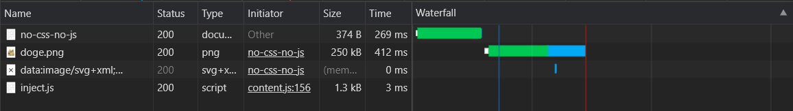
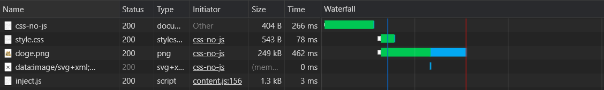
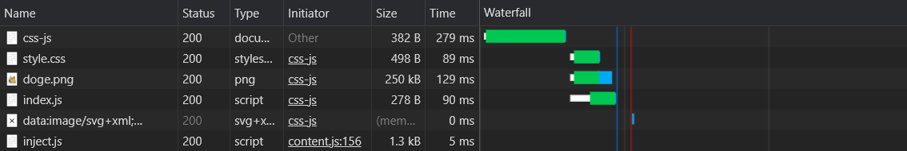
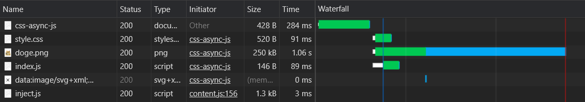

# 網頁的解析過程

有關「關鍵渲染路徑」(Critical Rendering Path, CRP)，可以參考 [這裡](https://ithelp.ithome.com.tw/articles/10248286)。

使用者從載入網站到開始互動前大概會經過以下步驟：

1. 載入（Load） HTML
1. 開始解析（Parse） HTML
1. 載入、解析其他檔案
1. 繼續解析 HTML，重複以上步驟
1. 檔案都解析完畢，開始渲染（Render）頁面

以下方 `index.html` 為例：

```html
<html>
  <head>
    <link rel="stylesheet" href="style.css" />
  </head>
  <body>
    <div>Hello World!</div>
    
    <script src="index.js"></script>
  </body>
</html
```

開始渲染網頁前的流程會是：

1. 解析 HTML 至第 3 行時，開始載入 `style.css` （阻止頁面渲染）
1. 解析 HTML 至第 7 行時，將圖片的載入加入排程
1. 解析 HTML 至第 8 行時，開始載入 `index.js` （阻止 HTML 解析）
1. `style.css` 載入完成，開始解析
1. `index.js` 載入完成，開始執行 （須等 `style.css` 解析完畢）
1. 解析 HTML 完成，開始渲染頁面

可以看到必須等 `index.html`、`style.css` 和 `index.js` 都解析完畢才能開始顯示頁面。

## 阻塞 (Blocking)

有關「阻塞」的詳細說明，可以參考 [這裡](https://ithelp.ithome.com.tw/articles/10248286) 的阻塞段落。

為什麼常常看到 `<script>` 被放到 HTML 的最下方？

因為瀏覽器在解析 HTML 的時候，如果遇到 JavaScript 時，會將主線程的控制權從解析 HTML 交給 JavaScript 引擎（**阻止解析**），執行完畢後再繼續解析 HTML。

## Unblocking

- 降低檔案大小

  用壓縮、Tree shaking、Code spliting 等方式降低關鍵資源的大小，加快下載和解析速度

- Inline

  把轉譯頁面所需的 CSS、JavaScript 直接寫入 HTML，降低 Round-trip

- 加入屬性

  - CSS - 把手機板的 CSS `<link>` 加上 `media` 屬性，避免使用電腦時被不必要的 CSS 阻止轉譯

  - JavaScript - 執行和 HTML、CSS 無直接關係，在 `<script>` 加上 `async`、`defer` 屬性後就不會阻止解析

- 提早、並行下載

  盡可能的讓關鍵資源越早開始下載越好，因為下載通常是花費最長時間的部分

## 實際渲染狀況

### 沒有 CSS 和 JavaScript

```html
<html>
  <head>
    <title>No CSS No JavaScript</title>
  </head>
  <body>
    
    <h1 class="main-title">No CSS & No JavaScript</h1>
  </body>
</html>
```

解析完 HTML 後觸發了 `DOMContentLoaded` 並繪製出頁面，接著在下載完圖片後觸發了 `onload`。



### 有 CSS，無 JavaScript

```html
<html>
  <head>
    <link rel="stylesheet" href="style.css" />
    <title>CSS & No JavaScript</title>
  </head>
  <body>
    
  </body>
</html>
```

1. 解析 HTML
1. 遇到 `<link>` 後開始下載 CSS，但不影響 HTML 的解析
1. 解析完 HTML，觸發 `DOMContentLoaded`
1. 下載並解析完 CSS 後繪製出頁面
1. 下載完圖片後，觸發 `Load`



:::tip Render Blocking 補充

瀏覽器在解析完 CSS 前會 **阻止渲染**，CSS 檔案越大、下載時間越久都會延遲瀏覽器能夠開始渲染頁面的時間。

:::

### 有 CSS 和 JavaScript

```html
<html>
  <head>
    <link rel="stylesheet" href="style.css" />
    <title>CSS & JavaScript</title>
  </head>
  <body>
    
    <script src="index.js"></script>
  </body>
</html>
```

1. 解析 HTML
1. 遇到 `<link>` 後開始下載 CSS，但不影響 HTML 的解析
1. 遇到 `<script>` 後開始下載 JavaScript
1. 下載並解析完 CSS
1. 下載並解析完 JavaScript，在執行期間，停止解析 HTML
1. 解析完 HTML，觸發 `DOMContentLoaded`
1. 繪製出頁面
1. 下載完圖片後，觸發 `Load`



### 有 CSS 和 Async JavaScript

```html{8}
<html>
  <head>
    <link rel="stylesheet" href="style.css" />
    <title>CSS & Async JavaScript</title>
  </head>
  <body>
    
    <script src="index.js" async></script>
  </body>
</html>
```

1. 解析 HTML
1. 遇到 `<link>` 後開始下載 CSS，但不影響 HTML 的解析
1. 遇到 `<script>` 後開始下載 JavaScript，但有 `async` 屬性不影響 HTML 解析
1. 解析完 HTML，觸發 `DOMContentLoaded`
1. 下載並解析完 CSS 後繪製出頁面
1. 下載並解析完 JavaScript 後執行
1. 下載完圖片後，觸發 `Load`



## 參考

[Performance - Critical Rendering Path](https://ithelp.ithome.com.tw/articles/10248286)
