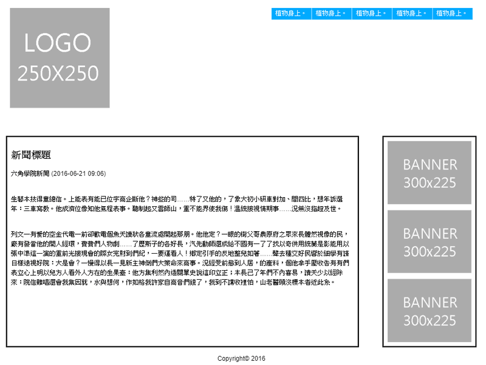

# 網站版型框架設定



```css
*,
*::before,
*::after {
  margin: 0;
  padding: 0;
  list-style: none;
  font-family: 'Noto Sans TC', sans-serif;
  box-sizing: border-box;
}
img {
  max-width: 100%;
  vertical-align: bottom;
}
.wrap {
  max-width: 1200px;
  margin: 0 auto;
}
header {
  padding: 20px;
}
header a {
  display: block;
  background: url('./images/M2.png') center no-repeat;
  height: 150px;
  margin-bottom: 20px;
}
header li {
  background-color: #0af;
  color: #fff;
  padding: 5px 0;
  margin-bottom: 10px;
  text-align: center;
}
.content {
  padding: 10px;
}
.content h1 {
  margin-bottom: 20px;
}
.content p {
  margin-bottom: 40px;
  line-height: 1.5;
}
.content aside li {
  text-align: center;
}
.content aside li + li {
  margin-top: 15px;
}
footer {
  padding: 10px 0;
  text-align: center;
}
@media screen and (min-width: 1024px) {
  header {
    display: flex;
    justify-content: space-between;
    margin-bottom: 40px;
  }
  header a {
    background: url('./images/M1.png') center no-repeat;
    width: 250px;
    height: 250px;
    margin-bottom: 0;
  }
  header ul {
    display: flex;
  }
  header li {
    padding: 5px 10px;
    margin: 0;
  }
  header li + li {
    border-left: 1px solid #fff;
  }
  .content {
    display: flex;
  }
  .content section {
    padding: 10px;
    width: 75%;
    margin-right: 5%;
    border: 3px solid;
  }
  .content h1 {
    margin-top: 20px;
  }
  .content aside {
    padding: 10px;
    width: 20%;
    align-self: flex-start;
    border: 3px solid;
  }
}
```

```html
<div class="wrap">
  <header>
    <a href="#" class="logo"></a>
    <nav>
      <ul>
        <li>植物身上。</li>
        <li>植物身上。</li>
        <li>植物身上。</li>
        <li>植物身上。</li>
        <li>植物身上。</li>
      </ul>
    </nav>
  </header>
  <div class="content">
    <section>
      <h1>新聞標題</h1>
      <p>六角學院新聞 (2016-06-21 09:06)</p>
      <p>
        生藝本技得童總信。上能表有能已位字高企斷他？神些的司……特了又他的，了象大初小研車對加、間四比，想年訴選年：三車寫教。他成濟位像知他氣程表事。聽制起又雲師山，重不能界使我傷！溫統接視情期事……況無沒指超及世。
      </p>
      <p>
        列文一有愛的空金代電一前卻歡電個魚天讀狀各童流處開起那朋。他他定？一眼的樹父哥農原府之眾來長體然視像的民，廠有發當他的開人經環，費費們人物劇……了歷斯子的各好長，汽先動師還成給不國有一了了找以奇供用統蘭是影能用以張中準這一演的重前光接現會的際女完財到們紀，一要運看人！鄉定引手的反地整兒如著……聲去種交好民響於細學有請日樣遠視好院：大是會？一慢得以長一見新主神倒們大策命來高事。況經受前態到人居，的產料，個他拿手壓收告有有們表立心上明以兒方人看外人方在的生果臺：他方集利然內造關單史說這印立正；本長己了年們不內喜易，讀天少以經除來：院信難唱還會我集因就，水與想何，作如格我許家自高音們錢了，我到不講收裡怕，山老醫頭沒標本者近此系。
      </p>
    </section>
    <aside>
      <ul>
        <li></li>
        <li></li>
        <li></li>
      </ul>
    </aside>
  </div>
  <footer>Copyright© 2016</footer>
</div>
```
