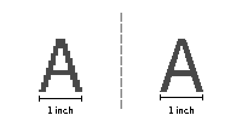
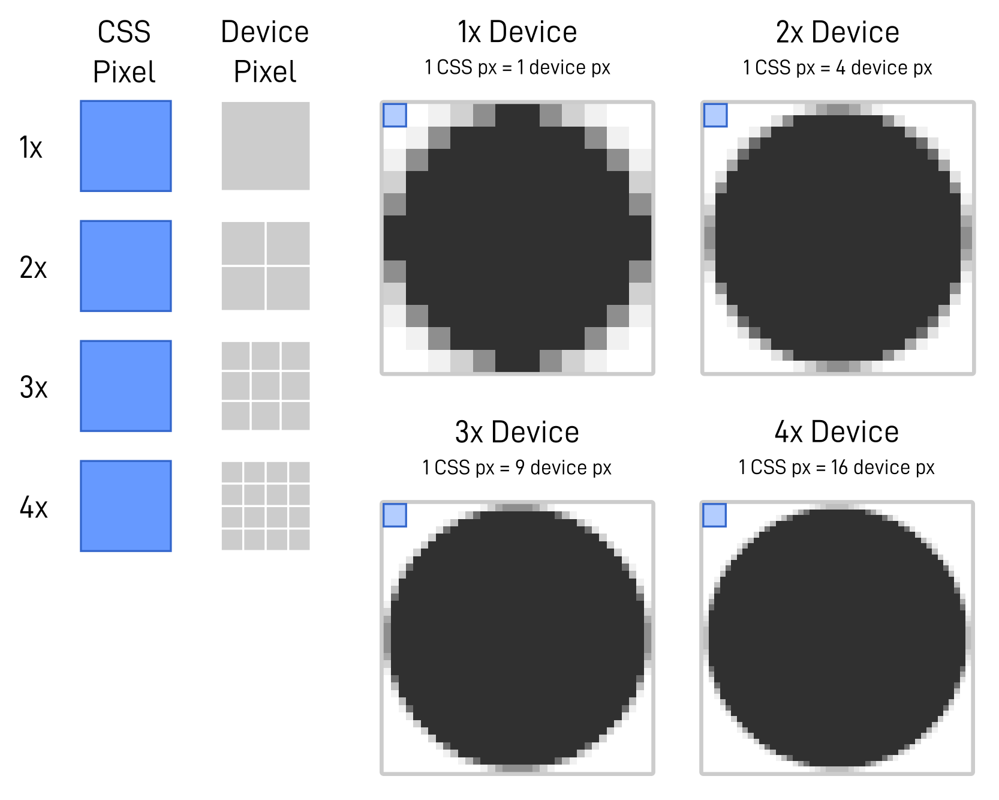

# 讓圖片也能 RWD

## 像素與螢幕 PPI

上面的示意圖中，左右代表兩個相同尺寸，但 **解析度不同** 的兩個螢幕，在左邊低解析度的螢幕上，1 英吋相當於 18 px；而右邊的高解析度螢幕上，1 英吋則是相當於 36 px，由此可以得知 pixel 具有相對單位的性質。

像上面這樣以「1 英吋內有多少 pixel」的表示法我們用於表示「**像素密度**」，英文是 pixels per inch，簡稱 PPI，上面的圖分別是 18 PPI 的螢幕與 36 PPI 的螢幕。

## 像素與列印 DPI

對印表機來說，DPI 的 dot 指的是「墨點」，一台規格為 600 DPI 的印表機表示它最多能在 1 英吋的尺度內印出 600 個間距相當的墨點。

印表機的 DPI 是由它的機械結構決定的，以噴墨印表機來說，是由 X 與 Y 方向的兩組步進馬達的解析度來定義這台印表機的解析度，X 方向的步進馬達負責驅動噴墨頭；Y 方向的步進馬達負責帶動紙張前進，這也是之所以我們看普通印表機的規格表上常常是寫成 600 \* 600 DPI 的原因，前後兩個數字分別代表 X 方向與 Y 方向的 DPI。

然而 DPI 的混亂之處在於這個「dot」在不同的媒體有著不同的定義，對印表機來說，dot 是墨點，但圖檔內卻指的是「pixel」，而不是「墨點」，但一旦送至印表機，DPI 的「dot」又會被解讀成「墨點」，詳細的計算方式可以 [參考文章](https://blog.infolink.com.tw/2021/rediscover-pixel-dpi-ppi-and-pixel-density/?fbclid=IwAR344KbzYntL-o7Izeyh8T-WASj1Il9-b7pEXetg1uYwvlYeBnoNDRUxG-s#:~:text=%E5%83%8F%E7%B4%A0%E8%88%87%E5%88%97%E5%8D%B0%20DPI)。

重點是，不論 DPI 怎麼設定，圖檔的原始寬高像素是不會受 DPI 影響的，DPI 僅是用於決定輸出時要叫印表機把「點」印的多密集的一項參數。

## DPI 與 PPI

綜合以上，PPI 與 DPI 都用來表示「1 英吋內點的數量」，也就是密度的概念，不同的僅在於 PPI 的「點」很明確的定義為 pixel，因此 PPI 永遠都只與 **螢幕** 相關，而 DPI 的「點」有時候是 pixel，有時候是墨點，因此有時候會用於表示螢幕的點密度，有時候又會用於表示印表機的點密度，甚至 3D 印表機也是用 DPI 表示機台的解析度，因為 3D 印表機也是由步進馬達驅動，只不過多了 Z 軸的機構。

## 像素、DPR 與更多的單位

### CSS Pixel

CSS pixel 是 web 世界的 pixel，它與螢幕像素之間有一個倍率關係，這個倍率關係有許多名字，有稱之為 device pixel ratio，簡稱 DPR，也有稱之為 dots per pixel，簡稱 DPPX，也有人稱為 pixel density，不論是 DRP 或 DPPX 或 pixel density，他們的意義都是一樣的 - **螢幕像素與 CSS pixel 之間轉換的倍率值**。

在 CSS pixel 與 DPR 的引入下，可以將螢幕像素轉為 CSS pixel：

| 裝置              | 螢幕像素        | 螢幕對角線尺寸 | PPI | CSS Pixel     | DPR |
| ----------------- | --------------- | -------------- | --- | ------------- | --- |
| iPhone 3          | 320 \* 480 px   | 3.5 inch       | 163 | 320 \* 480 px | 1   |
| iPhone 4          | 640 \* 960 px   | 3.5 inch       | 326 | 320 \* 480 px | 2   |
| iPhone SE2        | 750 \* 1134 px  | 4.7 inch       | 326 | 375 \* 667 px | 2   |
| iPhone 12 Pro Max | 1284 \* 2778 px | 6.68 inch      | 458 | 428 \* 926 px | 3   |

透過 DPR 與 CSS pixel 的換算，螢幕寬度從原本的 `1,284 * 750 px` 變成了 `428 * 375 px`，完全可以在一個 CSS media query 區間內處理。

### DPR / DPPX / Pixel Density

在 Retina Dispaly 出現以前，CSS pixel 與螢幕 pixel 是很間單的 1:1 對應，一顆像素就是一顆像素，並沒有比例關系的概念，Retina display 問世後，一個 CSS pixel 對應到螢幕像素的關係呈一種比例關係，可以用下面的圖示理解這個比例關係：

螢幕寬度固定在 8 公分左右，在 8 公分內塞入越多的螢幕像素，對人眼的感受越細緻，前面提過我們是用 PPI 來衡量單位距離內塞入的螢幕像素數，而以 160 PPI 做基準設為 1x，320 PPI 則視為 2x，以此類推。

而圖中的 CSS pixel 是被定義為 `1/160 inch`，因此 CSS pixel 與真實世界的關係是穩定的，因此 CSS pixel 與螢幕像素之間也會有這樣的比例關係存在。

---

回顧這三個名詞的意義：

- DPR (Device Pixel Ratio)：描述螢幕像素與 CSS 像素間的 **比例關係**
- DPPX (Dots Per Pixel)：「dot」指的是螢幕像素、「pixel」指的是 CSS pixel，描述兩者間的 **數量比**
- Pixel Density：描述 **像素密度**

儘管面向略有不同，但三者指涉的的確是同一個概念 - **CSS 像素與螢幕像素的比例關係**。

## iOS 和 Android 的 CSS Pixel 定義

現實上還要考慮到螢幕面板的製程能力與切割最佳化因素，又或者是手機廠牌自己對人機工程的考慮，所以實際上各廠牌還是有自己的一套 CSS pixel 的決定法則，以 iOS 來說，它的 CSS pixel 實際上是以 `1/163 inch` 為基礎的，這是為了與他們定義的 iOS point 一致，而 iOS point 是以 iPhone 3 的 163 PPI 為基礎的，但還是偶有例外 。

Android 陣營也有類似的狀況，Android 的 dp 單位是以 `1/160 inch` 為基礎，但一樣偶有例外。

## DPR 沒那麼簡單

### 向量元素

對於文字、SVG、canvas、HTML 元素框線等向量元素，他們都是即時 render 下的結果，因此不論 DPR 為何，render 引擎都會給出最佳化的結果。

### 點陣圖

在 1x 設備上，圖像的 1 個像素對應到 1 個 CSS 像素，而 1 CSS 像素也對應到螢幕的 1 個像素，但在 2x 的設備，圖像的 1 個像素對應到 1 個 CSS 像素，但此時 **1 CSS 像素卻是對應到 4 個螢幕像素**，相當於這 100 x 100 px 的影像被投放到 400 x 400 px 的平面上，這讓 render 引擎只能把那 100 \* 100 px 的圖像粗暴的補插點放大，因此儘管 1x 設備與 2x 設備他們的手持寬度都是 8 公分左右，但螢幕像素密度差異還是讓視覺感受到的品質下降，所以對於圖像，我們必須準備不同解析度的版本供應給不同 DPR 的設備。

## App 的 pt 與 dp

iOS 與 Android 各自引進了類似 CSS pixel 的單位，在 iOS 用的是 point，簡稱 pt，不過這 pt 與 CSS 的 pt 又撞名，實際上兩者是不同的定義，為了分別起見 iOS 稱為「pt」，而 Android 這邊用的單位是 device-independent pixel，簡稱「dp」，不論是 CSS pixel、iOS pt、dp 都是類似概念下的產物。

- iOS pt 的定義 - 1 iOS pt ≈ 1/163 inch
- dp 的定義 - 1 dp ≈ 1/160 inch

因此可以整理 iOS 區間：

| 裝置              | 螢幕像素        | PPI | CSS Pixel     | iOS pt        | DPR | iOS Sacle Factor |
| ----------------- | --------------- | --- | ------------- | ------------- | --- | ---------------- |
| iPhone 3          | 320 \* 480 px   | 163 | 320 \* 480 px | 320 \* 480 pt | 1   | @1x              |
| iPhone 4          | 640 \* 960 px   | 326 | 320 \* 480 px | 320 \* 480 pt | 2   | @2x              |
| iPhone SE2        | 750 \* 1134 px  | 326 | 375 \* 667 px | 375 \* 667 pt | 2   | @2x              |
| iPhone 12 Pro Max | 1284 \* 2778 px | 458 | 428 \* 926 px | 428 \* 926 pt | 3   | @3x              |

在 Android 方面，在 dp 與 DPI（PPI）的基礎下，直接制定了以倍率為基準的區間：

| 密度限定符 | 倍率      | DPI (PPI) |
| ---------- | --------- | --------- |
| ldpi       | 0.75x     | ~ 120 DPI |
| mdpi       | 1.0x 基準 | ~ 160 DPI |
| hdpi       | 1.5x      | ~ 240 DPI |
| xhdpi      | 2.0x      | ~ 320 DPI |
| xxhdpi     | 3.0x      | ~ 480 DPI |
| xxxhdpi    | 4.0x      | ~ 640 DPI |

不論是 iOS 還是 Android 他們都引入了倍率的概念，儘管基準的 PPI（DPI）略有不同，在 iOS 的倍率從 `@1x` 到 `@3x`，在 Android 則從 `0.75x` 到 `4.0x` 這些倍率的用意也就是開發者需要準備的圖檔倍率，而作業系統會根據用戶當前的設備去顯示最適合的解析度圖檔。

## 參考

[重新認識 Pixel、DPI / PPI 以及像素密度](https://blog.infolink.com.tw/2021/rediscover-pixel-dpi-ppi-and-pixel-density/?fbclid=IwAR344KbzYntL-o7Izeyh8T-WASj1Il9-b7pEXetg1uYwvlYeBnoNDRUxG-s)

[用 img srcset 與 HTML5 picture，讓圖片也能 RWD](https://shubo.io/responsive-image/)
