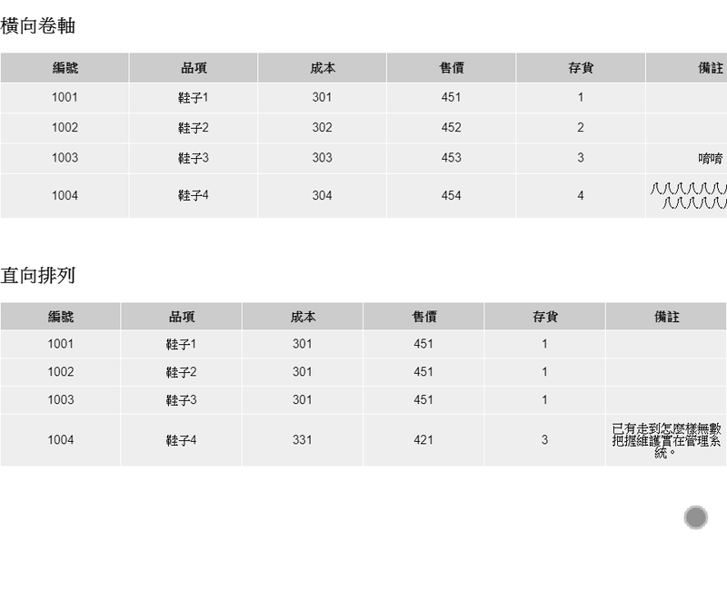

# 響應式表格設計



:::tip 說明

橫向滾輪表格的 `overflow-x: auto` 需放於 `table` 的外層

:::

```css
*,
*::before,
*::after {
  margin: 0;
  padding: 0;
  list-style: none;
  font-family: 'Noto Sans TC', sans-serif;
  box-sizing: border-box;
}
.wrap {
  max-width: 1024px;
  margin: 0 auto;
  /* 需放在外層 */
  overflow-x: auto;
}
h2 {
  margin: 20px 0;
}
table {
  width: 100%;
  margin-bottom: 40px;
  border-collapse: collapse;
}
th,
td {
  border: 1px solid #fff;
  text-align: center;
  padding: 10px 0;
  min-height: 40px;
}
th {
  background-color: #cccccc;
  width: 16.66666%;
}
td {
  background-color: #eeeeee;
}
.scroll-table {
  width: 1024px;
}
.straight-table tr,
.straight-table td {
  display: block;
}
.straight-table tr {
  margin-bottom: 10px;
}
.straight-table th {
  display: none;
}
.straight-table td {
  display: flex;
  padding: 0;
  line-height: 38px;
}
.straight-table td::before {
  content: attr(data-th) '：';
  background-color: #aaaaaa;
  width: 30%;
  text-align: center;
  margin-right: 1rem;
}
@media screen and (min-width: 769px) {
  .straight-table tr {
    display: table-row;
    margin-bottom: 0;
  }
  .straight-table th,
  .straight-table td {
    display: table-cell;
    padding: 10px 0;
    line-height: 1;
  }
  .straight-table td::before {
    display: none;
  }
}
```

```html
<div class="wrap">
  <h2>橫向卷軸</h2>
</div>
<div class="wrap">
  <table class="scroll-table">
    <tr>
      <th>編號</th>
      <th>品項</th>
      <th>成本</th>
      <th>售價</th>
      <th>存貨</th>
      <th>備註</th>
    </tr>
    <tr>
      <td>1001</td>
      <td>鞋子1</td>
      <td>301</td>
      <td>451</td>
      <td>1</td>
      <td></td>
    </tr>
    <tr>
      <td>1002</td>
      <td>鞋子2</td>
      <td>302</td>
      <td>452</td>
      <td>2</td>
      <td></td>
    </tr>
    <tr>
      <td>1003</td>
      <td>鞋子3</td>
      <td>303</td>
      <td>453</td>
      <td>3</td>
      <td>唷唷</td>
    </tr>
    <tr>
      <td>1004</td>
      <td>鞋子4</td>
      <td>304</td>
      <td>454</td>
      <td>4</td>
      <td>八八八八八八八八八八八八八八八八八八</td>
    </tr>
  </table>
</div>
<div class="wrap">
  <h2>直向排列</h2>
  <table class="table straight-table">
    <tr>
      <th>編號</th>
      <th>品項</th>
      <th>成本</th>
      <th>售價</th>
      <th>存貨</th>
      <th>備註</th>
    </tr>
    <tr>
      <td data-th="編號">1001</td>
      <td data-th="品項">鞋子1</td>
      <td data-th="成本">301</td>
      <td data-th="售價">451</td>
      <td data-th="存貨">1</td>
      <td data-th="備註"></td>
    </tr>
    <tr>
      <td data-th="編號">1002</td>
      <td data-th="品項">鞋子2</td>
      <td data-th="成本">301</td>
      <td data-th="售價">451</td>
      <td data-th="存貨">1</td>
      <td data-th="備註"></td>
    </tr>
    <tr>
      <td data-th="編號">1003</td>
      <td data-th="品項">鞋子3</td>
      <td data-th="成本">301</td>
      <td data-th="售價">451</td>
      <td data-th="存貨">1</td>
      <td data-th="備註"></td>
    </tr>
    <tr>
      <td data-th="編號">1004</td>
      <td data-th="品項">鞋子4</td>
      <td data-th="成本">331</td>
      <td data-th="售價">421</td>
      <td data-th="存貨">3</td>
      <td data-th="備註">已有走到怎麼樣無數把握維護實在管理系統。</td>
    </tr>
  </table>
</div>
```
